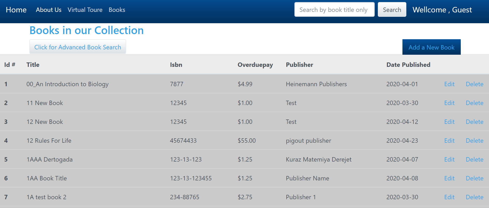

## HTML5 , CSS ,  Bootstrap
## eLibary system  - project 
  
## Project Requirements
# CS571 Workshop 03
## GitHub Notes App
The following ReactNative Expo project is to search and display information about GitHub profiles. Clone the repo and install all deps.
The application should boot a Stack Navigation with the following screens:
* Search (main page, users will search for a certain GitHub account)
* Dashboard (Displays the account picture, with 3 buttons: Profile, Repositories, and Notes)
* Profile (Displays profile details about the selected GitHub account)
* Repositories (Displays the latest repos for the selected GitHub account)
* WebView (Browse the source code for a certain repo)
* Notes (Add local notes)
  
* Developing the eLibrary web application using CSS framework (such as Bootstrap) to apply necessary styling, to achieve this sample look and page layou.
* The Books data (which is presented in JSON format)  will be obtained from a remote Restful service API hosted online at the url - https://elibraryrestapi.herokuapp.com/elibrary/api/book/list. To fetch and present the data, posted on the web page.
* JavaScript code is used to post new book lists and delete books from the remote host server. 

[*Click to connect to  eLibrary web application !!* ](https://fitsum-elibrary.netlify.com/index.html) 

@Fitsum Gebremariam 
 
